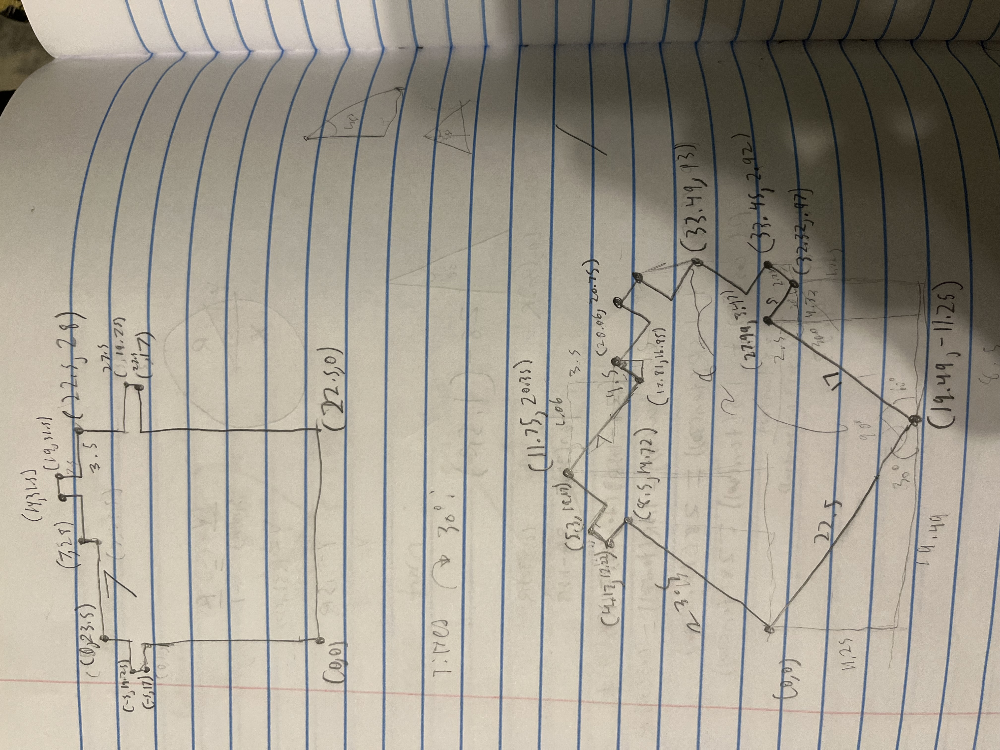
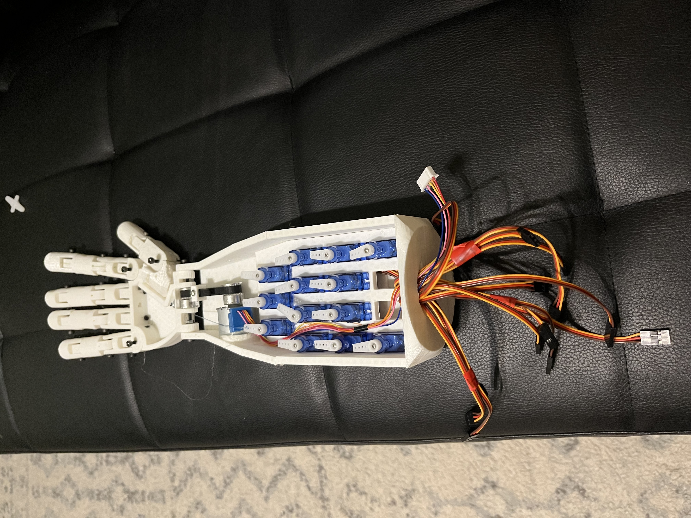
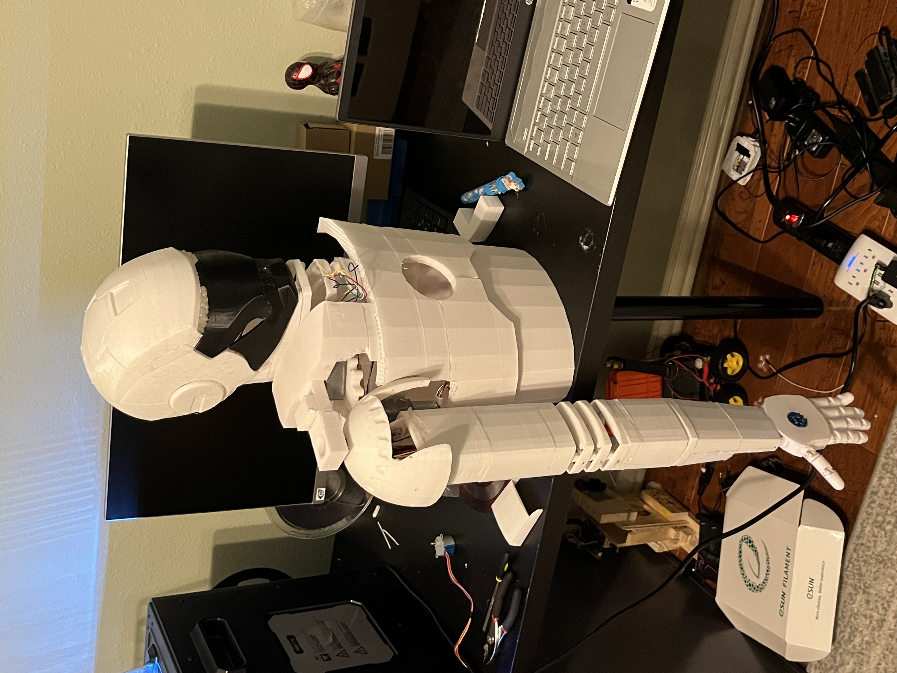

# My Maker Portfolio
Name : John Lezama

I am a Senior in Tomball High School eager to deepen my skills in engineering and research to solve real world problems.

## Highlight Project:

### Elecotromyography Controlled Prosthetic Arm
Date: October, 2023 - Febuary, 2024

Developed a motorized prosthetic arm for my 10th Grade Science Fair Project using DC motors, various mechanisms and H-Bridge motor drivers. I then integrated EMG sensors and developed an alogorithm that converted those EMG signals into motor function. 

 

       

Skills: Designing (AutoDesk Inventor), 3D-printing Assembly, Arduino Programming, Soldering, Electronics, Neuro-control

## Key Arduino Projects:

  ### 1. First Project!
  Date: 2018

  My passion for motors and mechanisms began at a very young age. One of my very first projects was supplying power to a tiny DC motor to connect two magnets together.
  
  
  
  ### 2. Pencil Printer
  Date: 2022

   I wanted to put my 3D printing and programming skills to the test for my first Science Fair project. I created a CNC machine that would draw any image uploaded to it via micro SD-card, I achieved this through the following steps:
  1. Programming a Python edge detection program to convert colored images into outlined gray scale images.
  2. Get the pixel locations for the edges and save those coordinates onto a micro SD card.
  3. Connect the micro SD card to the Arduino and calculate the steps each stepper motor needs to take to reach the coordinates.
  4. Plot the point with the pencil, controlled by a servo motor.
  
  

  

  Skills: Designing (TinkerCAD), Arduino Programming, Python Programming, 3D-printing and Assembly

### 3. Robotic Arm
Date: 2022

Designed and 3D-printed robotic arm with 3 DOF using 2 stepper motors, a servo motor, and an Arduino.

 Skills: Designing (TinkerCAD), 3D-printing, Arduino Programming

 ### 4. FLL Robotics Project
Date: 2022

My middle school's FLL Robotics team needed help with their Innovative Project - an international competition where teams build a solution for a problem of their choice. While I was not a part of the team (I'm not a fan of legos) I was interested in helping them and they knew my capabilities with design, 3D-printing, and electronics. They wanted to automate package deliveries through essentially a vending machine that would select and drop packages off. I built a 2 x 3 feet wooden structure with 3 stepper motors that translated an electromagnet along the X, Y, and Z-axis to place packages into slots and also grab and deposit them.

    

.gif)

Skills: Designing (TinkerCAD), 3D-printing, Wood Working, Arduino Programming, Soldering, Electronics, and Prototyping

 ### 5. Life-Sized car
Date: 2022

I always had a fascination with the Batmobile, I knew if I could build my own life sized car making it remote controllable and strapping it with rapid fire nerf guns would be relatively easy. I also had a wood working phase during middle school and was eager to apply my skills in a project.

Skills: Designing (TinkerCAD), 3D-printing, Arduino Programming, Electronics, Wood Working, and Prototyping

### 6. ReConnected - A Medication Adherence System 
Date: 2023

For my 9th grade Science Fair, I partnered with another student who had experience building software applications. I designed and built the physical pill dispensing product, while he designed an app that wirelessly connected to the product and utilized positive reinforcement techniques to increae medication adherence in seniors.

Skills: Teamwork, Designing (TinkerCAD), 3D-Printing and Assembly, Painting, Bluetooth Interface

### 7. Trash-collecting Boat
Date: 2024

I would often walk around my neighborhood with my grandfather and brother. My favorite part of the walk was when we would stop by a nearby pond and throw stones. When I began noticing trash floating on the pond, mainly empty water bottles, I decided to use my skills to attempt a solution. Using 2 water-proof motors, an Arduino, a transciever, and a LiPo battery, I build a remote controlled boat with a compartment to scoop up plastic water bottles.

Skills: Designing (OnShape), 3D-printing, Arduino Programming, Electronics, and Prototyping

## Other Experience:

### FIRST Robotics - Mechanical Lead
Date: 2024-2025 Season

As the Mechanical Lead for my High School's FRC Robotics team I held several key responsibilities:
* I helped build a large part of the prototyping and assemmbly of the competition robot 
* Prepared and presented mechanical lessons for the new members.
* Led over 30 members in the construction of the field elements. 

Key Skills: Leadership, Machining, Assembling, and Prototyping

### Learn@STEM - Co-Founder
Date: October, 2024 - May, 2025

Key Skills:

### BlueSKY - Paid Intern
Date: June, 2025 - August, 2025

Key Skills:

