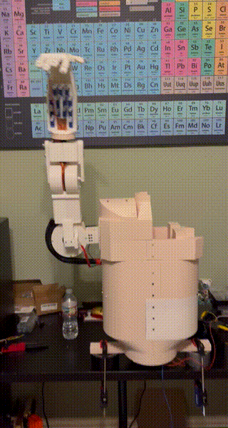

# My Maker Portfolio
Name : John Lezama

I’m a senior at Tomball High School, with a passion for mechanical design, robotics, and programming. I started building projects as a hobby when I was 11 and love it just as much today. Through hands-on engineering and research, I aspire to develop my skills to contribute to a better future.

## Table of Contents
- [Highlight Projects](#highlight-projects)
- [Key Arduino Projects](#key-arduino-projects)
- [Other Experience](#other-experience)
- [Reflection](#reflection)

## Highlight Projects:

### Electromyography Controlled Prosthetic Arm
Date: October, 2023 - February, 2024
[Repository](https://github.com/JohnLezama/EMG-Controlled-Prosthetic-Arm) 

I developed an EMG-controlled motorized prosthetic arm for my 10th Grade Science Fair Project using DC motors, various mechanisms, and H-Bridge motor drivers. I created it under $300 with the goal of making upper limb prosthetics more economically accessible for amputees.

Early sketches of the Hand and Wrist:

 

Other Images:

 

       

Skills: Designing (AutoDesk Inventor), 3D-printing Assembly, Arduino Programming, Soldering, Electronics, Neuro-control

### Carbon Capture Research Project
Date: October, 2024 - Present

Wanting to expand my horizons past engineering and produce a meaningful project regarding our increasingly worsening climate, I decided to pursue research for my 11th grade Science Fair Project. Using Grand Canonical Monte Carlo Simulations and online databases, I generated different zeolites - a mineral that serves as a filter in Carbon Capture technology - and simulated their performance in capturing CO2. I ran many different configurations until I discovered multiple promising zeolites that computationally beat current industry standards, potentially reducing carbon capture costs and encouraging its implementation globally.

I'm currently working on publishing a research paper for my work that can be found [here](Assets/UtilizingGrandCanonicalMonteCarloSimulationstToDiscoverOptimalZeolitesInPostCombustionCarbonCapture.pdf). 

My Science Fair Trifold is shown below:

Skills: Research, Monte Carlo Simulations, LAMMPS, Data Analysis, Excel, Computational Chemistry

[⬆ Back to Top](#my-maker-portfolio)

## Key Arduino Projects:

### 1. Trash-collecting Boat
Date: July, 2024

I would often walk around my neighborhood with my grandfather and brother. My favorite part of the walk was when we would stop by a nearby pond and throw stones. When I began noticing trash floating on the pond, mainly empty water bottles, I decided to use my skills to attempt a solution. Using 2 waterproof motors, an Arduino, a transceiver, and a LiPo battery, I built a remote-controlled boat with a compartment to scoop up plastic water bottles.

Skills: Designing (OnShape), 3D-printing, Arduino Programming, Electronics, and Prototyping

---

### 2. ReConnected - A Medication Adherence System 
Date: January, 2023

For my 9th-grade Science Fair, I partnered with another student who had experience building software applications. I designed and built the physical pill dispensing product, while he designed an app that wirelessly connected to the product and utilized positive reinforcement techniques to increase medication adherence in seniors.

Pill Dispenser Images: 

 

 

Skills: Teamwork, Designing (TinkerCAD), 3D-Printing and Assembly, Painting, Bluetooth Interface

---

### 3. Life-Sized car
Date: July, 2022

I always had a fascination with the Batmobile. I knew if I built my own life-sized car, making it remote-controlled and strapping it with rapid-fire Nerf guns would be relatively easy. I also had a woodworking phase during middle school and was eager to apply my skills in a project.

Skills: Designing (TinkerCAD), 3D-printing, Arduino Programming, Electronics, Wood Working, and Prototyping

---

### 4. FLL Robotics Project
Date: May, 2022

My middle school's FLL Robotics team needed help with their Innovative Project - an international competition where teams built a solution for a problem of their choice. While I was not a part of the team (I'm not a fan of LEGO), I was interested in helping them, and they knew my capabilities with design, 3D printing, and electronics. They wanted to automate package deliveries through essentially a vending machine that would select and drop packages off. I built a 2 x 3 feet wooden structure with 3 stepper motors that translated an electromagnet along the X, Y, and Z-axis to place packages into slots and also grab and deposit them.

    

.gif)

Skills: Designing (TinkerCAD), 3D-printing, Wood Working, Arduino Programming, Soldering, Electronics, and Prototyping

---

### 5. Robotic Arm
Date: April, 2022

Designed and 3D-printed robotic arm with 3 DOF using 2 stepper motors, a servo motor, and an Arduino.

 Skills: Designing (TinkerCAD), 3D-printing, Arduino Programming

---

### 6. Pencil Printer
Date: January, 2022

I wanted to put my 3D printing and programming skills to the test for my first Science Fair project. I created a CNC machine that would draw any image uploaded to it via a micro SD card. I achieved this through the following steps:
  1. Programming a Python edge detection program to convert colored images into outlined gray scale images.
  2. Get the pixel locations for the edges and save those coordinates onto a micro SD card.
  3. Connect the micro SD card to the Arduino and calculate the steps each stepper motor needs to take to reach the coordinates.
  4. Plot the point with the pencil, controlled by a servo motor.

 
  
  

  

  Skills: Designing (TinkerCAD), Arduino Programming, Python Programming, 3D-printing and Assembly

---

### 7. First Project!
Date: October, 2019

My passion for motors and mechanisms began at a very young age. One of my very first projects was supplying power to a tiny DC motor to connect two magnets together.

  

  Skills: Wiring, Motors

[⬆ Back to Top](#my-maker-portfolio)

## Other Experience:

### FIRST Robotics - Mechanical Lead
Date: September, 2024 - May, 2025

As the Mechanical Lead for my High School's FRC Robotics team I held several key responsibilities:
* I helped build a large part of the prototyping and assembly of the competition robot 
* Prepared and presented mechanical lessons for the new members.
* Led over 30 members in the construction of the field elements. 

Skills: Leadership, Machining, Assembling, and Prototyping

---

### Learn@STEM - Co-Founder
Date: October, 2024 - Present

Addressing the lack of STEM clubs at my local middle school and wanting to inspire younger students in STEM, I prepared and presented advanced STEM activities for sixth graders.

 

 

Skills: Leadership, Presentation, Instructions and Explaining, Design (OnShape), 3D-Printing, Electronics

---

### BlueSKY - Paid Intern
Date: June, 2025 - August, 2025

I worked as a paid intern at a local industrial air filtering company throughout the summer of 2025. I performed various tasks such as conducting air flow experiments on an industrial air filter machine, shown below!

I also wired multiple of their machines when demand for products was high and used my CAD skills to create drawings for their customers.

This internship gave me professional experience with Engineering and teamwork. It also allowed for me to finesse my wiring and CAD capabilities while growing my knowledge with pneumatic systems on an industrial level.

Skills: Active Listening, Design (Alibre), Physics, Electronics, and Prototyping

[⬆ Back to Top](#my-maker-portfolio)

## Reflection

From a very young age, I've been very inspired to grow my knowledge in engineering, programming, science, and research. Through various projects, I've developed skills in CAD, assembly, machining, fabrication, teamwork, leadership, programming, computational simulations, research, electronics, and problem-solving. My goal is to pursue a major that blends hardware and software, where I can continue to push myself to the limit and utilize my passion for impactful innovations.

[⬆ Back to Top](#my-maker-portfolio)
